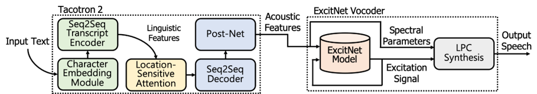

### Title
- Effective parameter estimation methods for an ExcitNet model in generative text-to-speech systems
### Authors
- Ohsung Kwon, Eunwoo Song, Jae-Min Kim, Hong-Goo Kang
### Abstract
- In this paper, we propose a high-quality generative text-to-speech (TTS) system using an effective spectrum and excitation estimation method. Our previous research verified the effectiveness of the ExcitNet-based speech generation model in a parametric TTS framework. However, the challenge remains to build a high-quality speech synthesis system because auxiliary conditional features estimated by a simple deep neural network often contain large prediction errors, and the errors are inevitably propagated throughout the autoregressive generation process of the ExcitNet vocoder. To generate more natural speech signals, we exploited a sequence-to-sequence (seq2seq) acoustic model with an attention-based generative network (e.g., Tacotron 2) to estimate the condition parameters of the ExcitNet vocoder. Because the seq2seq acoustic model accurately estimates spectral parameters, and because the ExcitNet model effectively generates the corresponding time-domain excitation signals, combining these two models can synthesize natural speech signals. Furthermore, we verified the merit of the proposed method in producing expressive speech segments by adopting a global style token-based emotion embedding method. The experimental results confirmed that the proposed system significantly outperforms the systems with a similarly configured conventional WaveNet vocoder and our best prior parametric TTS counterpart.

---

---

### Demo page
- [link](https://sewplay.github.io/demos/gst_tacotron2_excitnet/index.html)

### Submitted to
- [Speech Synthesis Workshop 2019](http://ssw10.oeaw.ac.at/)

### Preprinted version
- [arXiv 1905.08486](https://arxiv.org/abs/1905.08486/)
